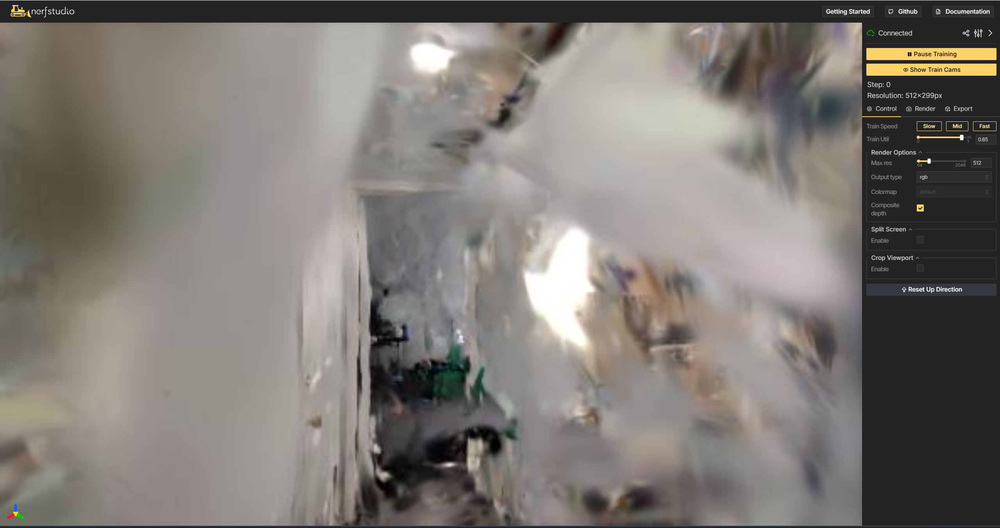
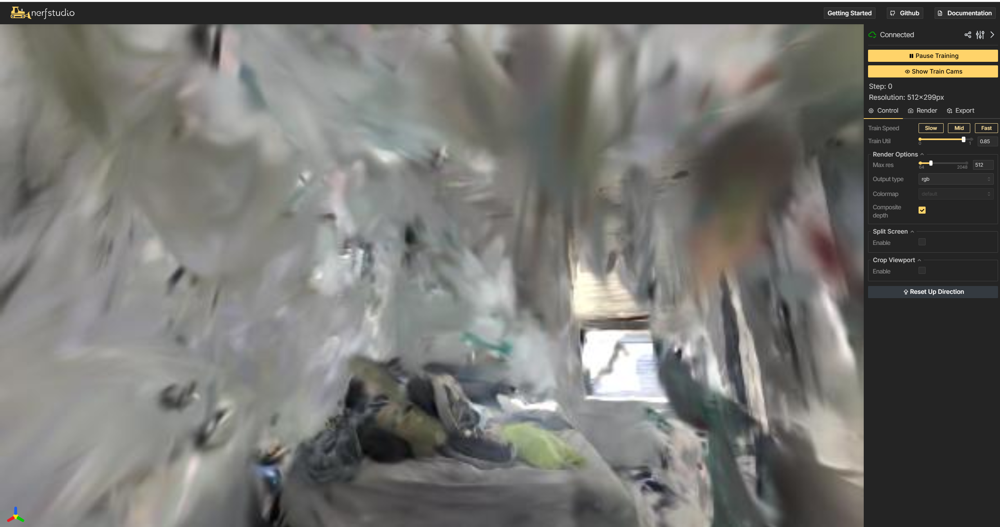
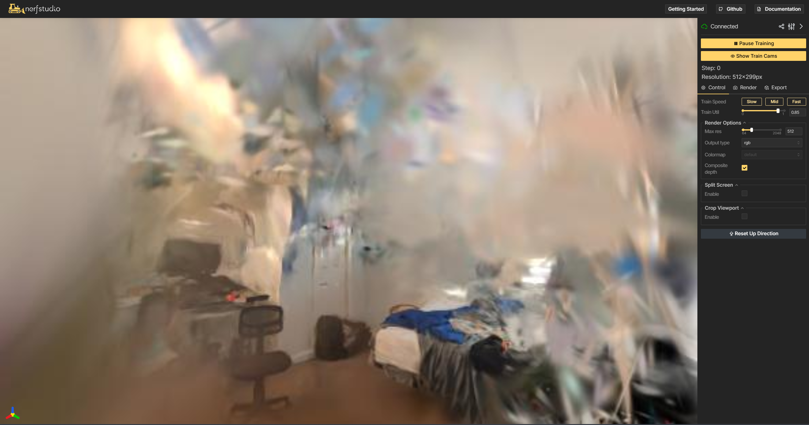
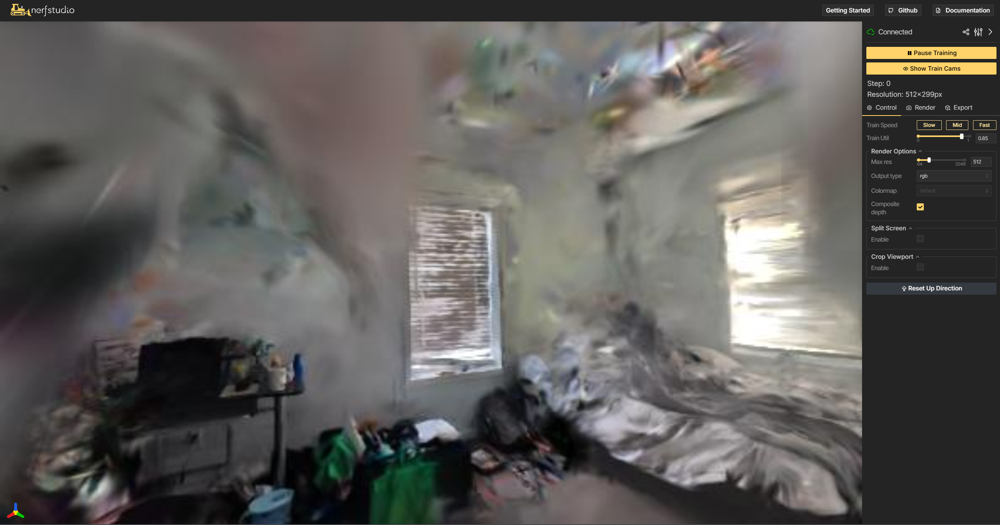
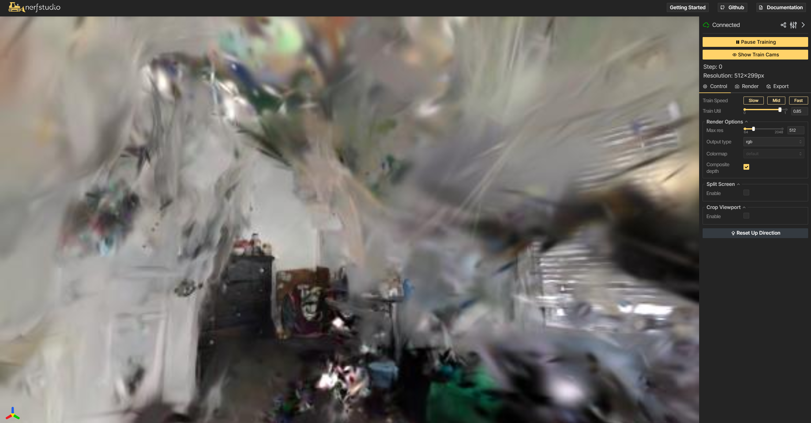

# 3D Gaussian Splatting — Indoor Multi-Room Reconstruction
### RTX 5070 Blackwell (sm_120) | WSL2 | Nerfstudio + gsplat

[]()
[]()
[]()
[]()

## 🎯 Challenge
Scan a multi-room space (3+ rooms, 1000+ images)
and generate a clean Gaussian Splat. Textureless walls required
for technical competence demonstration.

## 📸 Results

| Hallway | Room 1 | Room 2 |
|---------|--------|--------|
|  |  |  |

| Room 3 View 1 | Room 3 View 2 |
|---------------|---------------|
|  |  |

## 📊 Pipeline Metrics

| Stage | Metric | Value |
|-------|--------|-------|
| Video | Duration | 10 min, 4K 60fps |
| Frame Extraction | Frames extracted | 1,206 |
| Feature Detection | Features per frame | 1,700–8,000 SIFT |
| Feature Matching | Method | Sequential + VocabTree |
| SfM Registration | Images registered | 1,199 / 1,206 (99.4%) 🏆 |
| Sparse Reconstruction | 3D points | 294,245 |
| Camera Pose Error | Reprojection error | 0.567px 🏆 |
| Gaussian Training | Steps | 30,000 |
| Final Output | Gaussians | 917,370 |

## 🔄 Complete Pipeline
```
📱 Smartphone Video (OnePlus 11R, 4K 60fps, 10 min)
         ↓
🎞️ Frame Extraction (ffmpeg, 2fps, blur filter)
         → 1,206 frames @ 1920x1080
         ↓
🔍 Feature Detection (COLMAP SIFT)
         → 4,096 features/image max
         → GPU accelerated (RTX 5070)
         ↓
🔗 Feature Matching (COLMAP Sequential)
         → overlap=20, loop detection
         → vocab tree 256K words
         ↓
📐 Structure-from-Motion (COLMAP Mapper)
         → 1,199/1,206 cameras registered (99.4%)
         → 294,245 sparse 3D points
         → Mean reprojection error: 0.567px
         ↓
🗺️ Camera Pose Estimation
         → transforms.json (nerfstudio format)
         → All camera intrinsics + extrinsics
         ↓
🌐 Gaussian Splatting (nerfstudio splatfacto + gsplat)
         → 30,000 training steps
         → Random init for textureless walls
         → Scale regularization
         ↓
💾 Export (splat.ply)
         → 917,370 Gaussians
         → Viewable in superspl.at/editor
```

## ⚡ Key Technical Challenges Solved

### Challenge 1: RTX 5070 Blackwell (sm_120) — No PyTorch Support
**Problem:** Stable PyTorch doesn't include sm_120 kernels.
RTX 5070 falls back to CPU silently.

**Solution:**
```bash
# PyTorch nightly cu128 — only build with sm_120
pip install --pre torch torchvision torchaudio \
    --index-url https://download.pytorch.org/whl/nightly/cu128

# gsplat built from source with sm_120
export TORCH_CUDA_ARCH_LIST="8.0;8.6;9.0;12.0"
pip install git+https://github.com/nerfstudio-project/gsplat.git

# COLMAP built from source
cmake .. -DCMAKE_CUDA_ARCHITECTURES="80;86;90;120"
```

### Challenge 2: COLMAP Crashes at 1200+ Frames
**Problem:** Default exhaustive matching OOMs with 1200 frames.

**Solution:** Sequential matching + vocab tree loop detection:
```bash
colmap sequential_matcher \
    --SequentialMatching.overlap 20 \
    --SequentialMatching.loop_detection 1 \
    --FeatureMatching.max_num_matches 16384 \
    --SiftExtraction.max_num_features 4096
```

### Challenge 3: Textureless White Walls
**Problem:** White walls have no SIFT features → empty
Gaussians in wall regions.

**Solution:** Random Gaussian initialization:
```bash
--pipeline.model.num-random 100000 \
--pipeline.model.random-init True \
--pipeline.model.densify-grad-thresh 0.0001
```

### Challenge 4: COLMAP Ubuntu 22.04 + CUDA GCC Conflict
**Problem:** Ubuntu 22.04 default GCC incompatible
with CUDA compilation.

**Solution:**
```bash
sudo apt-get install gcc-10 g++-10
export CC=/usr/bin/gcc-10
export CXX=/usr/bin/g++-10
export CUDAHOSTCXX=/usr/bin/g++-10
```

### Challenge 5: COLMAP Vocab Tree Format Change
**Problem:** COLMAP switched from FLANN to FAISS (May 2025).
Old vocab trees crash new COLMAP.

**Solution:** Remove vocab_tree_path — COLMAP
auto-downloads the correct FAISS format tree.

## 🛠️ Installation & Setup

### Prerequisites
- Windows 11 + WSL2 Ubuntu 22.04
- NVIDIA GPU (sm_70+, tested on RTX 5070 sm_120)
- CUDA 12.8+ driver on Windows
- 16GB+ RAM, 50GB+ disk

### 1. Environment Setup
```bash
# Install Miniconda
wget https://repo.anaconda.com/miniconda/Miniconda3-latest-Linux-x86_64.sh
bash Miniconda3-latest-Linux-x86_64.sh

# Create environment
conda create -n gaussian_env python=3.11 -y
conda activate gaussian_env

# PyTorch nightly (sm_120 support)
pip install --pre torch torchvision torchaudio \
    --index-url https://download.pytorch.org/whl/nightly/cu128
```

### 2. Install gsplat (from source for sm_120)
```bash
export TORCH_CUDA_ARCH_LIST="8.0;8.6;9.0;12.0"
export CUDA_HOME=/usr/local/cuda-12.8
cd ~
git clone https://github.com/nerfstudio-project/gsplat.git
cd gsplat && git checkout v1.5.3
git submodule update --init --recursive
pip install . --no-build-isolation
```

### 3. Install COLMAP (from source, sm_120 + GCC10)
```bash
sudo apt-get install gcc-10 g++-10
export CC=/usr/bin/gcc-10
export CXX=/usr/bin/g++-10
export CUDAHOSTCXX=/usr/bin/g++-10
git clone https://github.com/colmap/colmap.git
cd colmap && mkdir build && cd build
cmake .. -GNinja \
    -DCMAKE_BUILD_TYPE=Release \
    -DCMAKE_CUDA_ARCHITECTURES="80;86;90;120"
ninja -j2
sudo ninja install
```

### 4. Install Nerfstudio
```bash
git clone https://github.com/nerfstudio-project/nerfstudio.git
cd nerfstudio && pip install -e ".[dev]"
```

## 🚀 Running the Pipeline
```bash
# Step 1: Extract frames
bash scripts/01_extract_frames.sh

# Step 2: COLMAP feature extraction
bash scripts/02_colmap_features.sh

# Step 3: Feature matching
bash scripts/03_colmap_matching.sh

# Step 4: Sparse reconstruction
bash scripts/04_colmap_mapper.sh

# Step 5: Convert to nerfstudio format
bash scripts/05_ns_process.sh

# Step 6: Train Gaussian Splat
bash scripts/06_train_splatfacto.sh

# Step 7: Export .ply
bash scripts/07_export_splat.sh
```

## 📁 Output Files

| File | Description | Size |
|------|-------------|------|
| `processed/colmap.db` | COLMAP database | 856 MB |
| `processed/sparse/0/` | Camera poses + 3D points | ~150 MB |
| `processed/transforms.json` | Nerfstudio camera format | 1 MB |
| `exports/splat.ply` | Final Gaussian Splat | ~200 MB |

## 🖥️ Hardware Used

| Component | Spec |
|-----------|------|
| GPU | NVIDIA GeForce RTX 5070 Laptop (Blackwell, sm_120) |
| VRAM | 8GB GDDR7 |
| Driver | 591.86 |
| CUDA | 13.1 (12.8 toolkit) |
| RAM | 16GB (WSL2: 12GB) |
| OS | Windows 11 + WSL2 Ubuntu 22.04 |

## ⏱️ Processing Time

| Stage | Time |
|-------|------|
| Frame extraction | 2 min |
| COLMAP feature extraction | 1.4 min |
| COLMAP matching | 1.2 min |
| COLMAP mapper | 117 min |
| Nerfstudio training (30k) | ~90 min |
| Export | 2 min |
| **Total** | **~215 min** |

## 📚 References

- [3D Gaussian Splatting (Kerbl et al., SIGGRAPH 2023)](https://repo-sam.inria.fr/fungraph/3d-gaussian-splatting/)
- [Nerfstudio](https://docs.nerf.studio/)
- [gsplat](https://docs.gsplat.studio/)
- [COLMAP](https://colmap.github.io/)
```

---

## What to put on GitHub vs what NOT to
```
✅ COMMIT:                    ❌ DON'T COMMIT:
scripts/                      input/ (1206 JPGs = ~300MB)
results/ (5 screenshots)      processed/ (COLMAP DB = 856MB)
docs/                         output/ (checkpoints = ~1GB)
README.md                     exports/splat.ply (200MB+)
.gitignore                    walkthrough.mp4 (4.4GB!)
requirements.txt              vocab_tree/ (binary)
config/                       miniconda3/